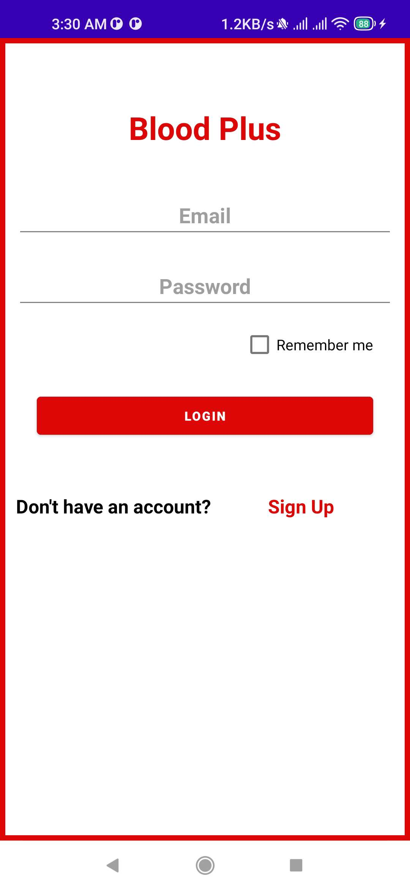
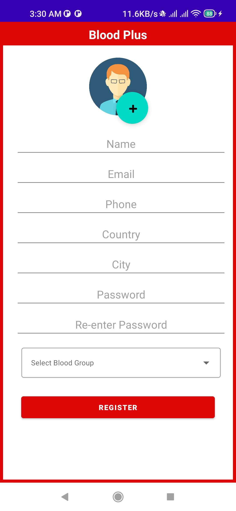
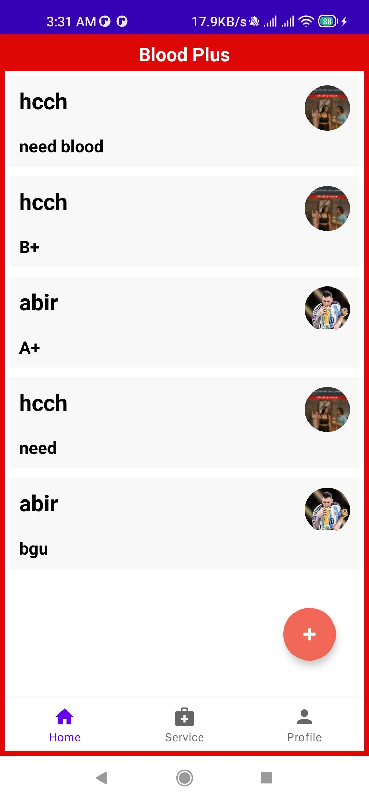
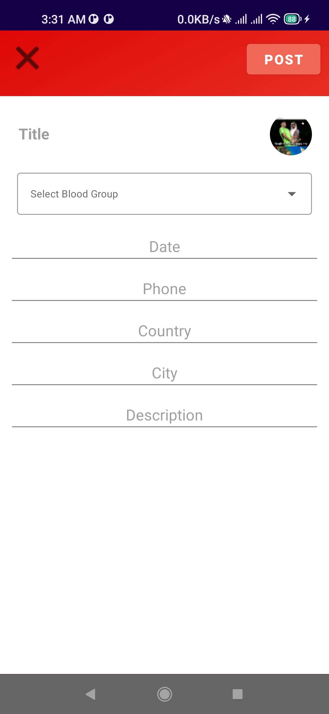
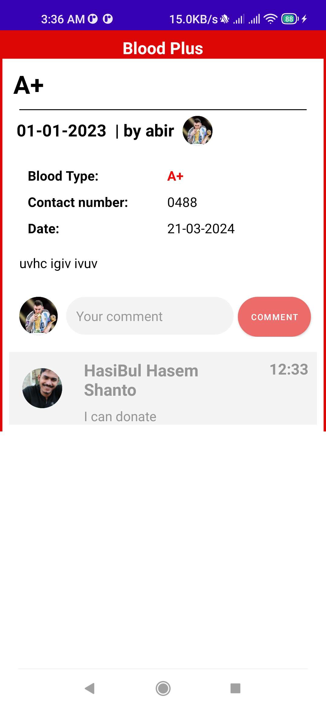
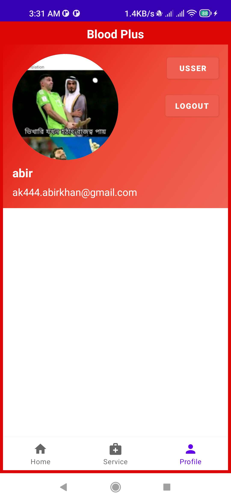

# BloodPlus

## Overview
**BloodPlus** is a mobile application designed to bridge the gap between blood donors and recipients in emergency situations. The app facilitates quick communication and interaction, making it easier to find blood donors when needed most. It incorporates various features such as Firebase for user authentication and data storage, SQLite for local data handling, and additional services like health tips to enhance user experience.

## Features

### Authentication
- **Login Page**: Uses Firebase to verify email and password. Shared Preferences are utilized to remember user login details.

- **Signup Page**: Stores user information in Firebase Database
 

.

### Home Page
- Retrieves data from Firebase Database, displaying relevant information to the user.

### Post Upload Page
- Employs SQLite for storing post information locally.

### Post Detail Page
- Additional services, such as intent handling, are used to provide a seamless user experience.
 

### User Profile
- Displays user details and offers health tips through an audio service.
- Firebase Cloud Storage is used for storing user images and audio files.

## Technical Details

### Backend
- **Firebase Database**: For user authentication, data storage, and retrieval.
- **Firebase Cloud Storage**: For storing user images and audio files.

### Local Storage
- **SQLite Database**: Used for managing local posts data.

### Other Components
- **Services**: Background services for handling operations like playing health tips audio.
- **Shared Preferences**: Used for user session management and storing simple data.
- **Intents and Intent Receivers**: For seamless navigation and communication between different components of the app.

## Business Model
The app follows a 'free with advertisement' business model with the potential for future sponsorships. It aims to help people in emergency situations by providing a reliable platform for finding blood donors.

## Future Improvements
Although the current version is functional, there are areas for further development, including:
- Adding features for users to update or delete their posts and comments.
- Enhancing the backend to avoid data retrieval issues and manage traffic more efficiently.

## Conclusion
BloodPlus might be a simple and small application, but it addresses a crucial need in the market. While currently hosted on a free hosting site with potential traffic limitations, we believe that with future improvements, this app could revolutionize the blood donation sector and potentially save lives.

## Acknowledgements
This project was submitted as part of a mini project for the Department of Computer Science & Engineering at East West University.

